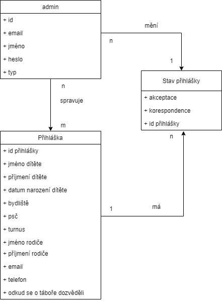

# Popis funkcí aplikace

Aplikace by byla určená pro správu přihlášek na letním dětském táboře. Obyčejný uživatel, který navštíví stránky, by měl mít možnost podat přihlášku. Podaná přihláška se propíše do databáze. Správce přihlášek, nějaký organizátor tábora, se po přihlášení dostane na zabezpečenou stránku, která mu vypíše seznam podaných přihlášek. Uživatel může editovat přihlášky a může si je vyexportovat do excelu. V databázi bude správce přihlášek uložen v tabulce admin. Kde bude sloupec type. Tento sloupec zde bude proto, že bude třeba rozlišit mezi obyčejným správcem přihlášek a majitelem tábora, který bude jen jeden. Majitel tábora bude mít možnost zasahovat do přihlášek víc. Bude moci přihlášky mazat, odesílat mail, který bude informovat o tom, zda byla přihláška přijata a samozřejmě akceptovat přihlášky. Potvrzení na mail o přijetí přihlášky není automatické, aby si mohl majitel tábora vybrat sám, koho na tábor vezme a koho ne. 

